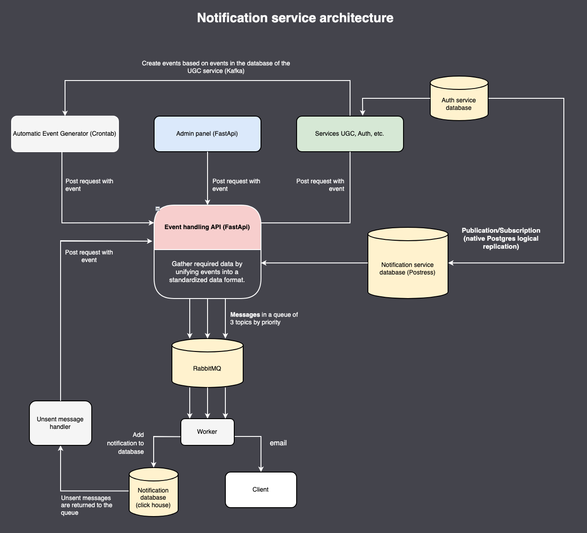
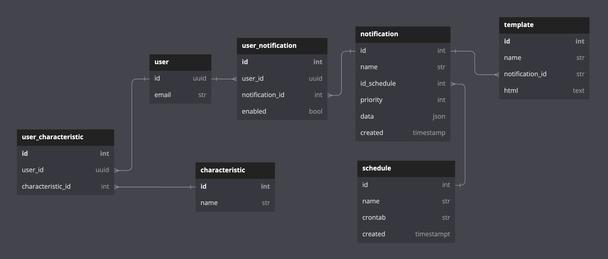

# Проектная работа 10 спринта

## Ссылка на репозиторий 
https://github.com/madridist20/notifications_sprint_1

Проектные работы в этом модуле в команде. Задания на спринт вы найдёте внутри тем.


<details>
<summary>Architecture scheme</summary>




</details>
<details>
<summary>Database scheme</summary>



</details>

## Project initialization

1. Create an .env file and fill it with values from `env.example`
2. Run Docker
```console
 docker-compose up --build
```

## API

Main API:

- `$HOST:8001/api/v1/`

Admin Panel:

- `$HOST:8000/admin`

For more detailed usage and API documentation, please refer to

- `$HOST/api/openapi/`